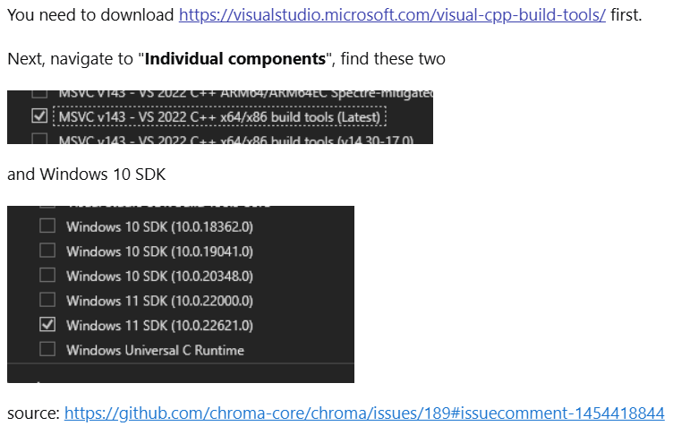

## Choix des Modèles et des Technologies

### Modèle d'Embedding


Pour notre système de récupération de l'information, nous avons opté pour le modèle `Lajavaness/bilingual-embedding-small`. Ce choix est justifié par plusieurs facteurs clés :

1. **Performance** : Le modèle se classe 23ème sur le leaderboard Massive Text Embedding Benchmark (MTEB) pour la récupération en français. Cette position témoigne de son efficacité à générer des embeddings pertinents pour des tâches de recherche de texte.

2. **Taille** : Avec moins de 250 millions de paramètres, `Lajavaness/bilingual-embedding-small` est le modèle le plus performant en termes de taille sur le leaderboard. Cela le rend particulièrement adapté pour une utilisation locale, car il nécessite moins de ressources computationnelles et peut être déployé sur des machines avec des capacités limitées.

3. **Bilinguisme** : Ce modèle est conçu pour travailler efficacement avec des données en français, ce qui est essentiel pour notre projet qui cible principalement ce langage.

### Base de Données Vectorielle


Pour le stockage et la gestion des embeddings, nous avons choisi **ChromaDB** pour les raisons suivantes :

- **Facilité d'utilisation** : ChromaDB offre une interface conviviale qui simplifie le processus d'intégration dans notre application.
  
- **Gratuité** : En tant que solution open-source, ChromaDB ne génère pas de coûts supplémentaires, ce qui est idéal pour le développement local.

- **Adapté à une utilisation locale** : ChromaDB est conçu pour fonctionner efficacement sur des environnements de développement locaux, permettant ainsi une expérience de développement fluide sans nécessiter d'infrastructure complexe.

---

## Fonctionnement du Système RAG

Le système RAG (Retrieval-Augmented Generation) suit les étapes suivantes pour traiter les requêtes de l'utilisateur via un assistant vocal :

1. **Entrée de la Requête** : L'utilisateur énonce sa requête à l'aide de l'assistant vocal. 

2. **Conversion Voix en Texte** : L'assistant vocal utilise des techniques de reconnaissance vocale pour transformer la voix de l'utilisateur en texte.

3. **Embedding du Texte** : Le texte converti est ensuite passé par un modèle d'embedding (`Lajavaness/bilingual-embedding-small` dans notre cas), qui génère un vecteur numérique représentant la requête.

4. **Recherche de Similarité** : À l'aide de la base de données vectorielle, le système recherche les questions les plus similaires en calculant la similarité entre le vecteur d'embedding de la requête et les vecteurs d'embedding des questions stockées dans la base de données.

5. **Récupération des Contextes** : Si des questions similaires sont trouvées, le système récupère les contextes (réponses) associés à ces questions.

6. **Passage aux LLM** : Les contextes récupérés sont ensuite passés au modèle de langage choisi, en l'occurrence **Gemini 1.5 Pro**.

7. **Règles de Génération** : Le LLM est contrôlé par des prompts système et RAG, qui lui fournissent des règles à suivre et le restreignent aux données récupérées. Cela garantit que les réponses générées sont pertinentes et basées sur les informations de la base de données.

8. **Génération de la Réponse** : Une fois que le LLM a été prompté, il génère une réponse.

9. **Conversion Texte en Parole (TTS)** : La réponse générée est ensuite convertie en parole à l'aide d'un système de synthèse vocale (Text-to-Speech, TTS) pour que l'utilisateur puisse l'entendre.

10. **Fin de la Session** : Le programme continue d'écouter les requêtes de l'utilisateur jusqu'à ce qu'il prononce le mot "stop", moment auquel le programme se termine.


---

## Instructions d'Utilisation

Pour utiliser ce projet, suivez les étapes ci-dessous :

### 1. Cloner le Dépôt

Ouvrez un terminal et exécutez la commande suivante pour cloner le dépôt :

```bash
git clone https://github.com/SadokBarbouche/Plug-Tel_TechnicalTest
```

### 2. Accéder au Dossier du Projet

Naviguez dans le dossier du projet :

```bash
cd Plug-Tel_TechnicalTest
```

### 3. Créer un Environnement Virtuel

Créez un environnement virtuel pour le projet :

```bash
python -m venv venv
```

### 4. Activer l'Environnement Virtuel

- **Sur macOS/Linux** :

```bash
source venv/bin/activate
```

- **Sur Windows** :

```bash
venv\Scripts\activate
```

Voici une version révisée de votre README pour améliorer la clarté et la présentation :

---

### 5. Installer les Dépendances

Installez ensuite les dépendances requises en exécutant la commande suivante :

```bash
pip install -r requirements.txt
```

Si vous êtes sur Windows, vous pourriez rencontrer une erreur lors de l'installation de Chroma. 


Voici un lien vers la solution: [Erreur d'installation de Chroma](https://stackoverflow.com/questions/73969269/error-could-not-build-wheels-for-hnswlib-which-is-required-to-install-pyprojec/76245995#76245995).



Puis essayer de réexecuter :
```bash
pip install -r requirements.txt
```
Le problème doit disparaitre.

### 6. Lancer l'Application

Après avoir installé les dépendances, vous pouvez lancer l'application avec la commande suivante :

```bash
python main.py
```

---
### 7. Détails du Refactoring et du Prototype
J'ai effectué un refactoring du code, notamment en le divisant en plusieurs modules. Des changements au niveau du vocal assistant vu que je ne dispose pas de OpenAI ChatGPT Key. Veuillez noter que la gestion des interactions entre l'utilisateur et l'assistant vocal est encore en phase de prototype, donc les interactions ne sont pas totalement optimisées pour le moment.

Cependant, vous pouvez déjà interagir avec l'assistant vocal sur des données du dataset sujet-ai/Sujet-Financial-RAG-FR-Dataset. Toute question en dehors des données de la base n'est pas acceptable comme c'est demandé.

